# Inventory Setups

 

Save gear setups for specific activities.

Contents
- [Creating a New Setup](#Creating-a-New-Setup)
- [Overview Panel](#Overview-Panel)
  - [Viewing a Setup](#Viewing-a-Setup)
    - [Compact Mode](#Compact-Mode)
    - [Icon Mode](#Icon-Mode)
  - [Sorting Modes](#Sorting-Modes)
  - [Moving a Setup](#Moving-a-Setup)
  - [Favorites](#Favorites)
- [Editing a Setup](#Editing-a-Setup)
- [Bank Filtering](#Bank-Filtering)
- [Highlighting](#Highlighting)
  - [Stack Difference](#Stack-Difference)
  - [Fuzzy Difference](#Fuzzy-Difference)
  - [Unordered Highlighting](#Unordered-Highlighting)
- [Additional Filtered Items](#Additional-Filtered-Items)
- [Sections](#Sections)
  - [Adding Setups to a Section](#Adding-Setups-to-a-Section)
  - [Remove Setups from a Section](#Remove-Setups-from-a-Section)
  - [Moving Setups in a Section](#Moving-Setups-in-a-Section)
  - [The Unassigned Section](#Unassigned-Section)
- [Exporting and Importing](#Exporting-and-Importing-Setups-and-Sections)
- [Configuration Settings](#Configuration-Settings)
- [Other Plugin Compatibilities](#Other-Plugin-Compatibilities)
  - [Bank Tag Layouts Plugin](#Bank-Tag-Layouts-Plugin)
  - [Bank Tags Plugin](#Bank-Tags-Plugin)
- [Data Storage](#Data-Storage)
- [Support and Suggestions](#Support-and-Suggestions)
  - [Donations](#Donations)
- [Changelog](#Changelog)

During this guide, some buttons/icons might look different compared to your client. This is because some pictures and gifs may be outdated.

## Creating a New Setup

To start, turn on the plugin and click on the equipment panel icon on the sidebar.

To create a new setup, gear up for the activity you would like to save, and then click on the green plus button at the top. It will prompt for a name, and then will take your current inventory and equipment and create a new setup.

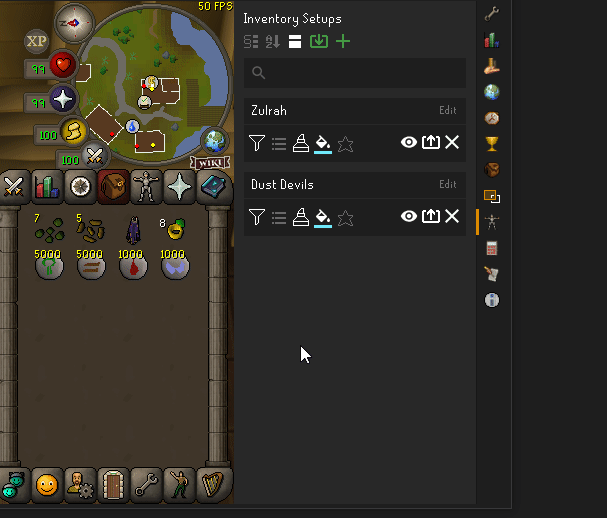

Setups must have a unique name and have a maximum length of 50 characters.

## Overview Panel

The overview panel contains all the setups and options to manipulate them.

### Viewing a Setup

You can view the setup by clicking on the view setups button (the eye icon). You can see that your inventory, equipment, rune and bolt pouch (if present), spellbook, additional filtered items (explained later) and notes are saved in the setup. 

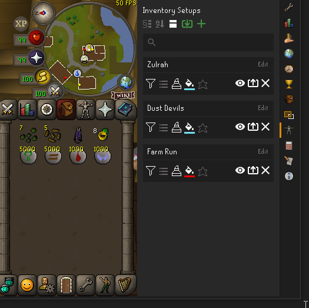

It is also possible to view setups in game. You can do this by right clicking the "Show worn items" button in the top left of the bank, and clicking on one of your setups.

In the config there are options to change which setups show up on the "show worn items" menu.

You can go back to the overview panel by clicking on the back arrow in the top right.

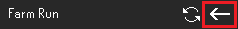

You can also search for setups using the search bar. When typing in the search bar, setups will be filtered if they contain the search text.

#### Compact Mode

You can switch the overview panel to "compact" mode by clicking on the switch view button at the top. Compact mode will only show the names of the setups on a shorter panel with no options so more can be seen without needing to scroll.

#### Icon Mode

Clicking the switch view button again will move you to Icon view. Icon mode will only show a small icon so you can fit even more setups.

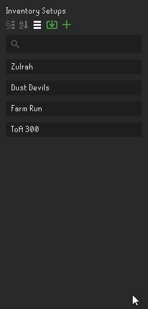

You can update an icon by right clicking a setup in Icon view and clicking "Update Icon..". By default, setups will try to use your weapon if no icon is provided. If there is no weapon, it will use a default icon (Cake of Guidance).

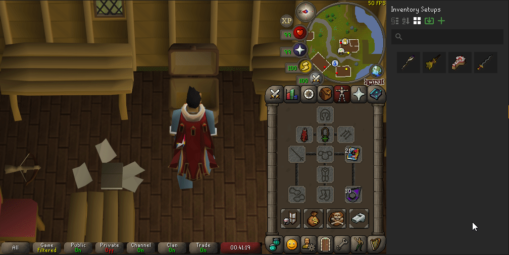

Click a third time on the switch view button at the top to go back to standard view. You can use the button to cycle all 3 views.

### Sorting Modes

Sorting modes allow for setups to be ordered in the overview panel in different ways.

Currently there is only one additional sorting mode, alphabetical. This will organize all setups alphabetically. You can return to the default sorting mode through the config or by clicking the alphabetical sort button.

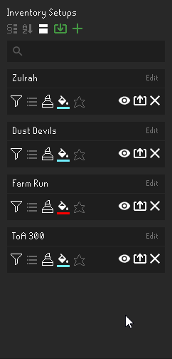

### Moving a Setup

Is it possible to move a setup up and down the list by right clicking near the setup name and selecting one of the menu options.

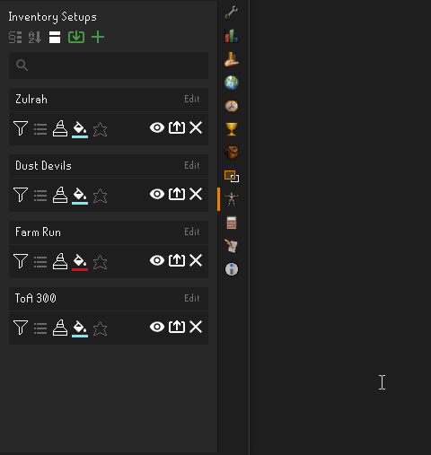

You cannot move setups if a sorting mode is enabled.

### Favorites

You can favorite your setups so they always appear at the top of the list unless you are searching for a setup.

## Editing a Setup

When viewing a setup, you can right click individual slots to update them, either from inventory/equipment, or from search. If you select from inventory/equipment, it will take the corresponding item from your inventory/equipment and update the slot.

If you select from search, it will open a search menu where you can search for the item, and then ask for a quantity if applicable.

The Rune and Bolt Pouch can also be updated with these options.

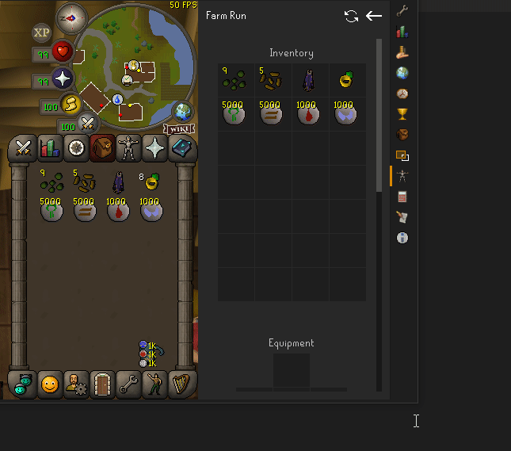

There is an option to remove items as well.

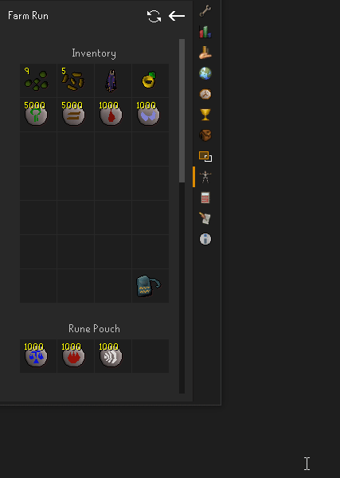

These options are only available when logged in.

You can also refresh an entire setup by using the refresh icon when viewing a setup.

You can update the spellbook by right clicking the slot and choosing the desired spellbook. There is also an option for none if you do not care about the spellbook for a particular setup.

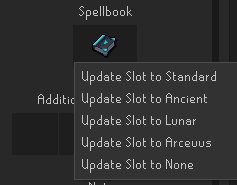

## Bank Filtering

One of the many buttons on each inventory setup panel is a bank filtering option. Enabling this will cause the bank to only show the items in your setup when being viewed. This is very similar to the bank tags plugin.

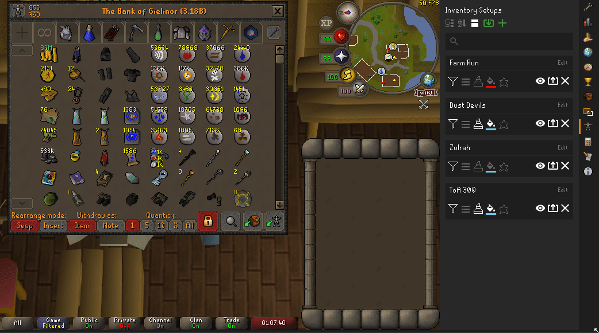

You can also filter specific parts of the setup, like the inventory, equipment, and additional filtered items. You can use this to quickly gear up with equipment before filling up your inventory. To do this, right click on the "Show worn items" button when a setup is selected, and you'll see options to filter specific parts of the setup. There are additional hotkeys that can be configured for these options as well.

When selecting a particular filtering mode, it will persist even when you leave the bank. In order to filter for all items again, you will need to select it from the "Show worn items" menu, or use the hotkey. Selecting a new setup will automatically be set to filter all items.

## Highlighting

You can enable highlighting to further assist in gearing up. Highlighting will cause slots to change color if an item in the player's inventory or equipment doesn't match the corresponding slot in the setup being viewed. To turn on highlighting, click on the button that looks like a highlighter. You can also change the highlight color with the next button over. There are also a few highlighting options for each setup.

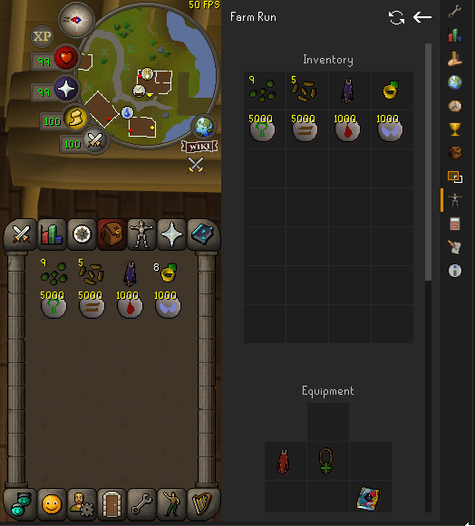

### Stack Difference

Enabling this will cause a slot to become highlighted if the stack size of the item in the player's inventory or equipment does not match the corresponding slot in the setup being viewed. This might be useful if you are at the chaos altar training prayer, and you want to be sure you don't bring more gp than needed to unnote the bones.

Greater than or less than stack difference can also be selected. These highlight if the item stack in the inventory is greater than or less than the amount in the setup respectively. This can be useful if you want a reminder that a stack is too low or too high.

Note that you must have base highlighting enabled in order to use this feature. There is a configuration option to set the default stack compare type for each slot when creating new setups.

#### Fuzzy Difference

Normally, Inventory Setups requires items to be **exactly** the same as those in the setup, else it will highlight the item, or not include it in the bank filter. This works for most items, but there are some cases where this is not desirable. Degradable items from Barrows are a great example. Ahrim's robetop 75 should be considered the same as Ahrim's robetop 100 for the purposes of highlighting and filtering.

It is possible to configure Inventory Setups to fix this issue using the "fuzzy" difference indicator. You can do this by right clicking any slot in the inventory or equipment panels, and selecting "Toggle Fuzzy". A "*" will appear in the top right corner of the slot if it is marked as fuzzy. The fuzzy indicator will make it so "similar" items are treated as equal for highlighting and filtering purposes.

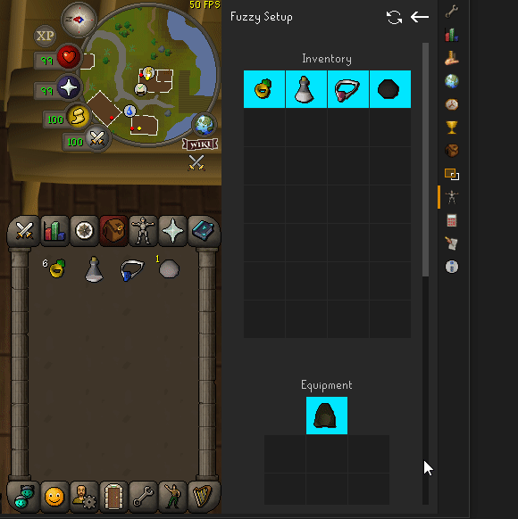

As you can see, there are different types of items that the "fuzzy" indicator can be used on. Jewellery with different charges, degradable items like Barrows, and potions with different doses are a few examples.

The fuzzy indicator will also impact bank filtering.

There is a configuration option to set all slots to fuzzy when creating new setups.

### Unordered Highlighting

Enabling this will cause highlighting to ignore order and only highlight items in the setup that are not present in the player's inventory. This is useful if you don't care about order and just want to make sure your inventory has all the items in the selected setup. It will not inform the player if they have extra items in their inventory that are not in the setup.

### Additional Filtered Items

You can add additional filtered items to setups. These are items that will show up in the bank filter along with the rest of the setup. This is really useful for things such as pre-potting, where you need the item at the bank but not at the activity the filter is made for. Follow these steps to add an additional filtered item:

* Select a setup
* Break the bank filter and navigate to the item you want to add to the additional items filter
* Hold SHIFT and RIGHT CLICK on the item and select "Add to Additional Filtered Items"
* The item will now show in the bank filter and in the "Additional Filtered Items" section
* You can remove an item from this list by right clicking and selecting "Remove Item from Slot"

You can also add or update items by using the search option. The fuzzy indicator can also be added to additional filtered items.

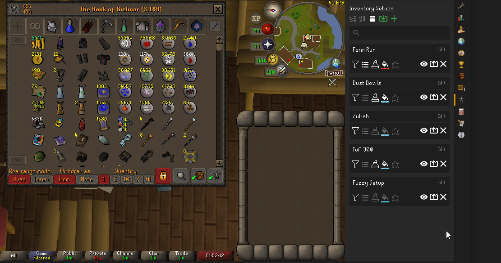

## Sections

Sections are a way to organize your setups into different categories. Here is a preview of what sections look like.

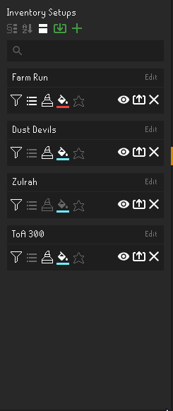

To get started, click on the section mode button at the top of the panel.

When you are in the section mode view, the add and import buttons can now be used to add or import sections instead of setups. You will also see the "Unassigned" section which shows all setups which are not assigned to a section.

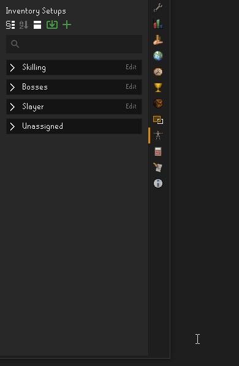

Like setups, section names have a maximum length of 50 and must be unique.

### Adding Setups to a Section

To add setups to your section, there are two ways to do this. You can right click a section and select "Add setups to section..". This will open a dialogue where you can select setups to add to the section.

You can also right click a setup and select "Add setup to sections.." This will open a dialogue where you can select sections for the setup to be a part of.

With both dialogues, you can CTRL + Click to select multiple options. The setups/sections displayed on the dialogue will be in alphabetical order.

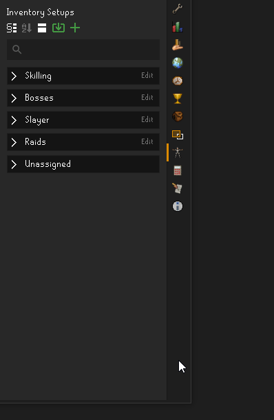

Once you have setups added to a section, you can view them by clicking the maximize arrow. You can minimize a section by clicking the arrow again.

Duplicate setups are not allowed in a section. If you selected setups which already exist in a section, they will not be added again. However, a setup can be a part of as many different sections as you'd like.

You can use the search bar to search for setups while in section mode. Any sections that don't have a matching setup will be hidden, and sections which do have a matching setup will automatically be maximized.

### Remove Setups from a Section

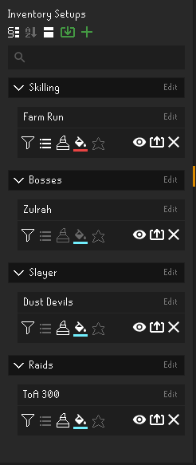

To remove a setup from a section, make sure you are in section view. Then you can right click on a setup and select "Remove from section". This will remove the setup from that section.

Do not use the X button to remove a setup from a section. This will simply delete your setup. When a setup is deleted, it will be removed from all sections.

### Moving Setups in a Section

You can right click a setup while in section mode and select one of the move options to move a setup within a section. This will not affect the position of the setup in the normal view. It only modifies the position within the section.

### Section Menu Options

Right clicking a section will show a menu with some options. Here you can move the section, export it, add setups to it, and delete it.

### Unassigned Section

The "Unassigned" section contains all setups which are not assigned to a section. It cannot be modified or deleted, and will always appear at the bottom. The setups can be searched for, viewed and added to other sections. Once a setup is added to a section, it will be removed from the unassigned section. If there are no "Unassigned" setups, this section will be hidden.

With this section, you do not need to switch from section mode to normal mode when attempting to view or modify a setup that is not in a section, and will give you an easy way to identify setups that may need a section. You can also minimize and maximize it just like any other section.

## Exporting and Importing Setups and Sections

It is possible to import and export inventory setups and sections. This is useful if you would like to share your setups with your friends. To export an inventory setup, click on the export button next to the view setup button. This will copy the setup to your clipboard. You can then send this to your friends.

To export a section, right click a section in section view and select the appropriate option.

To import a setup, click on the green import button at the top. It will prompt for a setup. Paste the setup and confirm.The new setup will be added to the bottom of the list of setups.

The same can be done for sections, but you must be in section view to import a section.

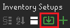

You can also mass import or export by right clicking the import button and following the instructions.

### Note About Importing

Duplicate names for setups or sections are not allowed in Inventory Setups. If you attempt to import a section or setup that has a name which already exists, the plugin will find a new name for it by adding a number to the end.

## Configuration Settings

In the settings of Inventory Setups, you can change default setup options, key binds, and other miscellaneous settings.

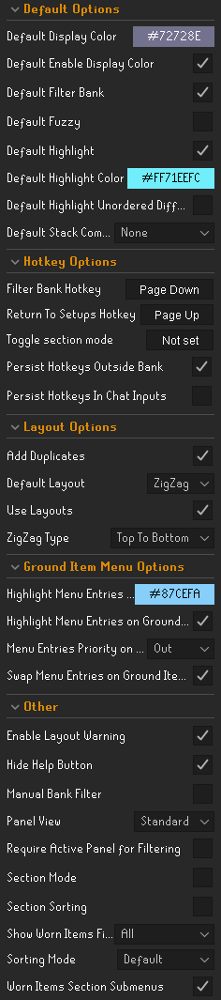

* **Default Filter Bank** - Enabling this will make it so all newly created setups will have bank filtering enabled
* **Default Highlight Stack Difference** - The default stack difference option for all newly created setups
* **Default Highlight Unordered Difference** - Enabling this will make it so all newly created setups will have unordered highlighting enabled
* **Default Highlight** - Enabling this will make it so all newly created setups will have highlighting enabled
* **Default Highlight Color** - The default highlighting color for newly created setups
* **Default Enable Display Color** - Enabling this will make it so all newly created setups will have the default display color
* **Default Display Color** - The default color that will be used as a display color for new setups. The option above must be enabled

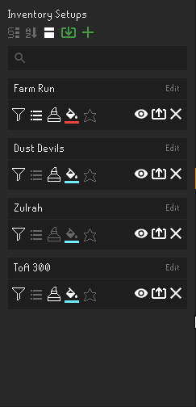
Hint: You can right click the paint bucket to delete the color of a setup or section.

* **Default Fuzzy** - Enabling this will make all slots fuzzy for newly created setups
* **Default Stack Compare** - The default stack comparison type for all slots in newly created setups

* **Return To Setups Hotkey** - Pressing this key will exit the current setup and return to the overview panel where all setups are shown
* **Filter Bank Hotkey** - Pressing this will cause the bank to filter if a setup is selected and filtering is enabled for that setup. This is useful if you canceled the filter while banking and want to quickly refilter
* **Filter Inventory Hotkey** - Pressing this will cause the bank to filter only the inventory of a setup if one is selected and filtering is enabled for that setup
* **Filter Equipment Hotkey** - Pressing this will cause the bank to filter only the equipment of a setup if one is selected and filtering is enabled for that setup
* **Filter Additional Items Hotkey** - Pressing this will cause the bank to filter only the additional filtered items of a setup if one is selected and filtering is enabled for that setup

* **Compact Mode** - Enabling this will change the setups to compact mode. It is equivalent to pressing the Compact Mode button on the overview panel
* **Sorting Mode** - The current sorting mode. It is equivalent to pressing the sorting mode button on the overview panel
* **Disable Bank Tab Separator** - Enabling this causes bank filtering to continue when the thin bank tab bar is clicked. This is useful if you are accidentally clicking the bar while retrieving items

* **Remove Bank Tab Separator** - Enabling this causes the bank tab separators to be removed when the bank is filtered. This is just like the bank tags option.

* **Require Active Panel for Filtering** - Enabling this will make it so filtering will only occur if the Inventory Setups Panel is selected. For example, if you have selected the hiscores panel and are viewing a setup with filtering enabled, the bank **will not** be filtered

* **Show Worn Item Filter** - Changes which setups show up on the "show worn items" button when right clicked.

* **Manual Bank Filter** - Enabling this causes the bank to not filter automatically when opened. You will need to manually trigger a bank filter by using a hot key or selecting a setup when the bank when it is already opened.

## Other Plugin Compatibilities

### Bank Tag Layouts Plugin 

The [Bank Tag Layouts Plugin](https://github.com/geheur/bank-tag-custom-layouts) is compatible with Inventory Setups and can be installed to create custom layouts for your bank filters.

### Bank Tags Plugin

Currently, there is one known compatibility issue with Bank Tags. If Bank Tags and Inventory Setups are both enabled, switching the withdraw type from Items to Notes (or vice versa) will cause the filter to exit. This is unfortunately not something that can be fixed. The only solution is to turn off the Bank Tags plugin. More info can be found [Here](https://github.com/dillydill123/inventory-setups/issues/29).

## Data Storage

Data for inventory setups is stored in your `settings.properties` file. This will be found in your `.runelite` folder in your user directory. For example, in Windows, the path may look like `C:\Users\<username>\.runelite\settings.properties`. If you are signed in to RuneLite, the file will be in the `profiles` folder.

Once you've found your `setting.properties` file, setup data can be found under the key `inventorySetups.setupsV2`. Section data can be found under the key `inventorySetups.sections`

Inventory Setups will sync your data to the cloud if you are signed in to RuneLite. It is still a good idea to mass export your setups every once in a while, especially if you aren't signed in to RuneLite.

## Support and Suggestions

If you need help, have any suggestions, or notice any bugs, you can comment them here in the issues section. If you do not have a github account, you can send a message to this reddit account: https://www.reddit.com/user/rlis1234

### Donations

Inventory Setups was developed by me in my free time (100+ hours of work). I did it for fun and to make something that others and myself would enjoy using without any intention of making money. However, if you'd like to donate to me, you can use [this link](https://www.buymeacoffee.com/dillydill123). Any amount is greatly appreciated!

## Changelog

##### 1.14
Added Icon mode and optimizations for how setups are stored

##### 1.13
Added sections and display colors to setups and sections

##### 1.12
Added ability to filter which setups are listed on "show worn items". Added favorites. Added ability to remove the bank tab separators. Added config option for manual bank filtering. Added mass import and export of setups. Added support for bolt pouch

##### 1.11
Toggle fuzzy now supports more items like God capes, twisted ancestral, and skilling outfits

##### 1.10
Added update window for patch notes and helpful links. Added configuration option to make all slots fuzzy in new setups. Added fuzzy options for additional filtered items. Made stack comparison slot specific.

##### 1.9
Reworked Variation Differences into Fuzzy Filtering, added specific filtering, more config settings, and improved update by search input 

##### 1.8
Added additional filtered items, remove options for slots, updated stack button

##### 1.7
Added notes, alphabetical sorting mode, more options to move setups, and more options to update rune pouch slots

##### 1.6
Added ability to switch setups in game with "Show worn items" button. Added spellbook to setups. Added help button (which can be disabled in the config settings)

##### 1.5
Added compact view and the ability to move setups up and down the list

##### 1.4
Added search bar and hotkeys for returning to setups and filtering bank

##### 1.3
Added Reset all button and rune pouch support.

##### 1.2
Settings, bank filtering, unordered highlighting, and update individual slots added

##### 1.1
Import and export feature added

##### 1.0
Plugin added
