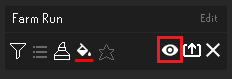
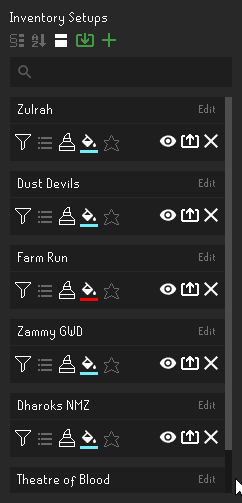
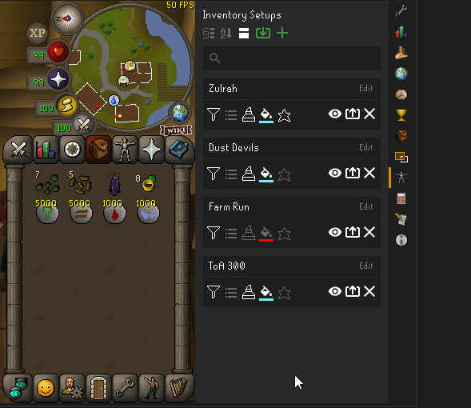
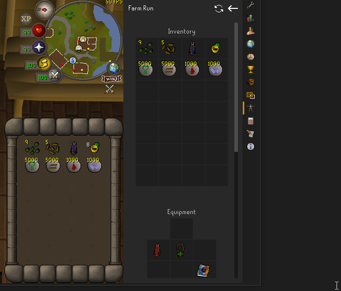
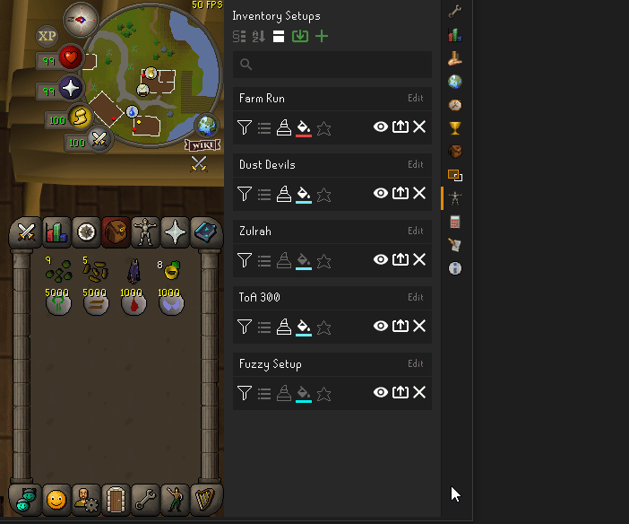
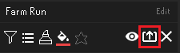

# Inventory Setups
Save gear setups for specific activities.

### Creating a New Setup

To start, turn on the plugin and click on the equipment panel icon on the sidebar.

To create a new setup, gear up for the activity you would like to save, and then click on the green plus button in the top right. It will prompt for a name, and then will take your current inventory and equipment and create a new setup.

### Overview Panel
The overview panel contains all the setups and options to manipulate them.

#### Viewing a Setup

You can view the setup by clicking on the view setups button (the eye icon). You can see that your inventory, equipment, rune pouch (if present), spellbook, and notes are saved in the setup. 

It is also possible to view setups in game. You can do this by right clicking the "Show worn items" button in the top left of the bank, and clicking on one of your setups.

You can go back to the overview panel by clicking on the back arrow in the top right.

You can also search for setups using the search bar. When typing in the search bar, setups will be filtered if they contain the search text.

You can switch the overview panel to "compact" mode by clicking on the triple rectangular button at the top. Compact mode will only show the names of the setups on a shorter panel with no options so more can be seen without needing to scroll.

#### Sorting Modes

Sorting modes allow for setups to be ordered in the overview panel in different ways.

Currently there is only one additional sorting mode, alphabetical. This will organize all setups alphabetically. You can return to the default sorting mode through the config or by clicking the alphabetical sort button.

#### Moving a Setup

Is it possible to move a setup up and down the list by right clicking near the setup name and selecting one of the menu options.

You cannot move setups if a sorting mode is enabled.

### Editing a Setup

When viewing a setup, you can right click individual slots to update them, either from inventory/equipment, or from search. If you select from inventory/equipment, it will take the corresponding item from your inventory/equipment and update the slot.

If you select from search, it will open a search menu where you can search for the item, and then ask for a quantity if applicable.

These two options are only available when logged in.

You can also refresh an entire setup by using the refresh icon when viewing a setup.

You can also update the spellbook by right clicking the slot and choosing the desired spellbook.

### Bank Filtering

One of the many buttons on each inventory setup panel is a bank filtering option. Enabling this will cause the bank to only show the items in your setup when being viewed. This is very similar to the bank tags plugin.

### Highlighting

You can enable highlighting to further assist in gearing up. Highlighting will cause slots to change color if an item in the player's inventory or equipment doesn't match the corresponding slot in the setup being viewed. To turn on highlighting, click on the button that looks like a highlighter. You can also change the highlight color with the next button over. There are also a few highlighting options for each setup. They are represented by most of the buttons on the left side of the setup panel. These options do influence what items appear in the bank when filtering is active.

##### Stack Difference

Enabling this will cause a slot to become highlighted if the stack size of the item in the player's inventory or equipment does not match the corresponding slot in the setup being viewed. This might be useful if you are at the chaos altar training prayer, and you want to be sure you don't bring more gp than needed to unnote the bones.

##### Variation Difference

Enabling this will cause a slot to become highlighted if the item in the player's inventory or equipment doesn't match the corresponding slot in the setup being viewed, even if it is very close. An example of this are rings of dueling. By default, a ring of dueling(8) will be considered the same as a ring of dueling(1). Enabling variation difference will make them distinct for the purposes of highlighting. This is useful if you are using bank filtering and you don't want all doses of potions to show up when gearing up.

##### Unordered Highlighting

Enabling this will cause highlighting to ignore order and only highlight items in the setup that are not present in the player's inventory. This is useful if you don't care about order and just want to make sure your inventory has all the items in the selected setup. It will not inform the player if they have extra items in their inventory that are not in the setup.

### Exporting and Importing Setups

It is possible to import and export inventory setups. This is useful if you would like to share your setups with your friends. To export an inventory setup, click on the export button next to the view setup button. This will copy the setup to your clipboard. You can then send this to your friends.

To import a setup, click on the green import button in the top right. It will prompt for a setup. Paste the setup and confirm. The new setup will be added to the bottom of the list of setups.

### Rune Pouch

Rune pouches are supported. If you have a old setup that contains a rune pouch, you will need to update the inventory setup as the rune pouch will only show empty runes. You can update the rune pouch individually by right clicking the slot with the rune pouch and updating from inventory.

You can also update the slots individually.

### Configuration Settings

In the settings of Inventory Setups, you can change the default options of bank filtering and highlighting for any new setups you create. This is useful if you have a favorite highlight color and don't want to change every new setup to use that color. It also contains some key binds that you can set to return to the overview panel quickly, or filter the bank again if you accidentally clicked on a different tab. You can also enable compact mode here, hide the help button, and change the sorting method of setups.

One config setting worth noting is "Disable Bank Tab Bar". Enabling this causes bank filtering to continue when the thin bank tab bar is clicked. This is useful if you are accidentally clicking the bar while retrieving items.

### Compatibility with Bank Tags

Currently there is one known compatibility issue with Bank Tags. If Bank Tags and Inventory Setups are both enabled, switching the withdraw type from Items to Notes (or vice versa) will cause the filter to exit. This is unfortunately not something that can be fixed. The only solution is to turn off the Bank Tags plugin. More info can be found [Here](https://github.com/dillydill123/inventory-setups/issues/29).

### Support and Suggestions

If you need help, have any suggestions, or notice any bugs, you can comment them here in the issues section. If you do not have a github account, you can send a message to this reddit account: https://www.reddit.com/user/rlis1234

### Changelog

##### 1.0
Plugin added

##### 1.1
Import and export feature added

##### 1.2
Settings, bank filtering, unordered highlighting, and update individual slots added.

##### 1.3
Added Reset all button and rune pouch support.

##### 1.4
Added search bar and hotkeys for returning to setups and filtering bank

##### 1.5
Added compact view and the ability to move setups up and down the list

##### 1.6
Added ability to switch setups in game with "Show worn items" button. Added spellbook to setups. Added help button (which can be disabled in the config settings).

##### 1.7
Added Notes